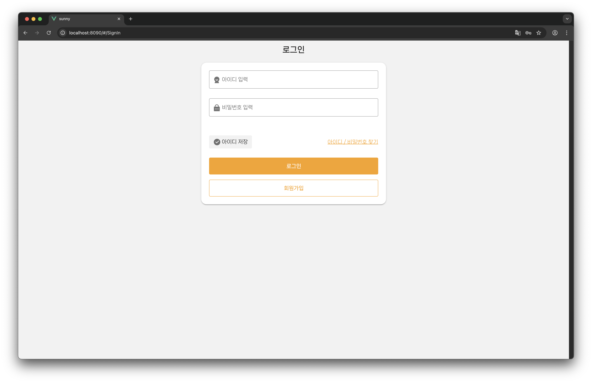
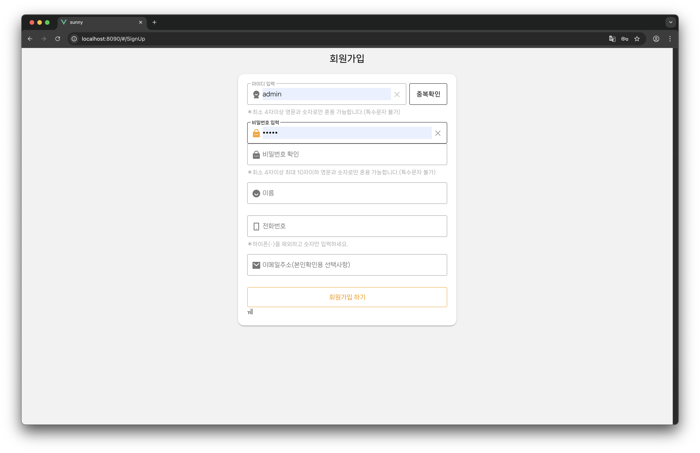
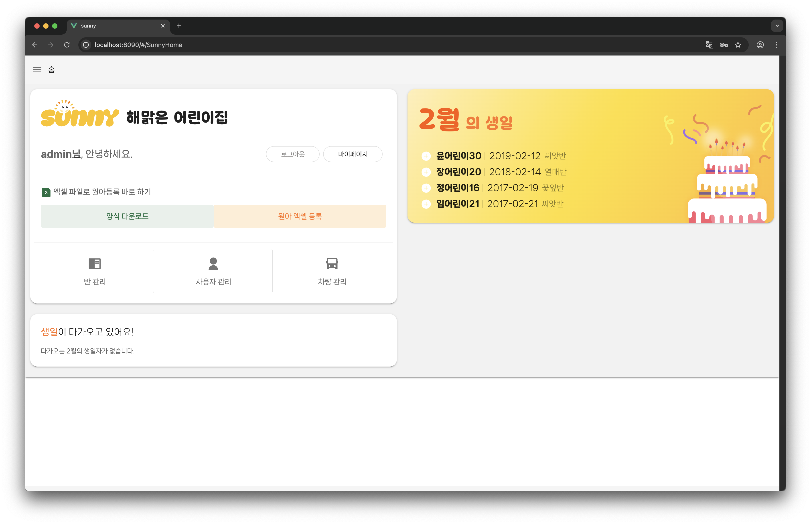
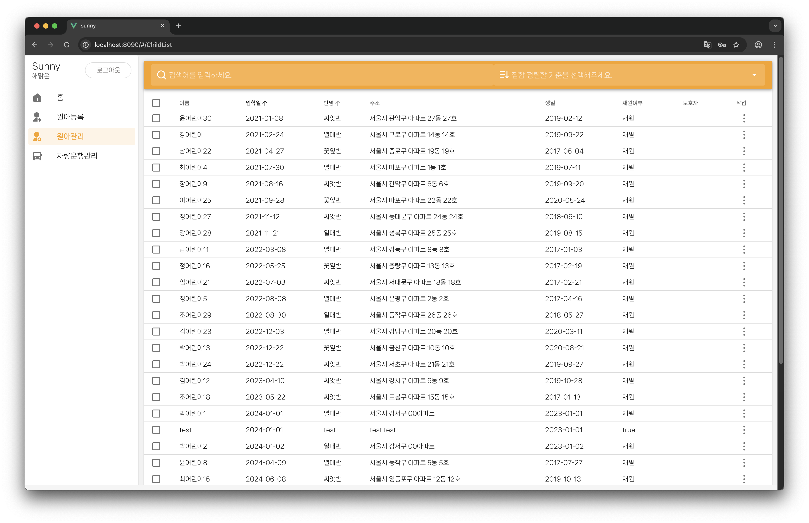
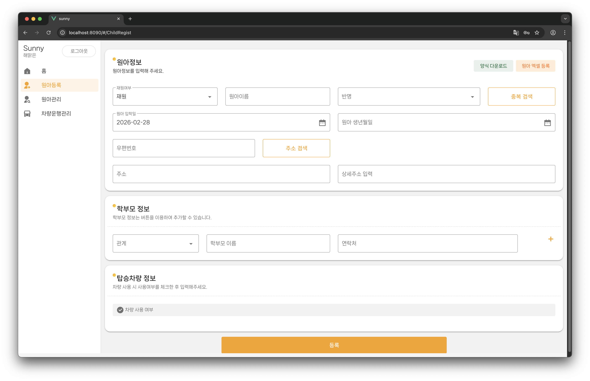
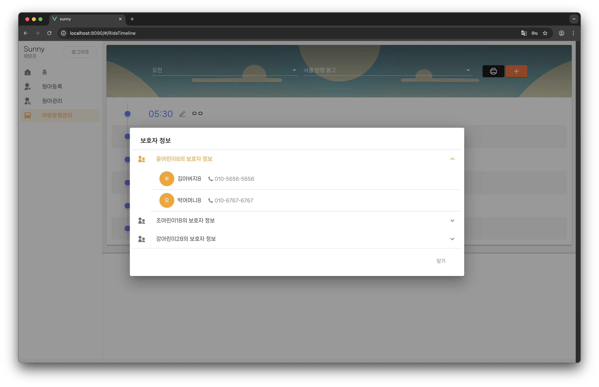
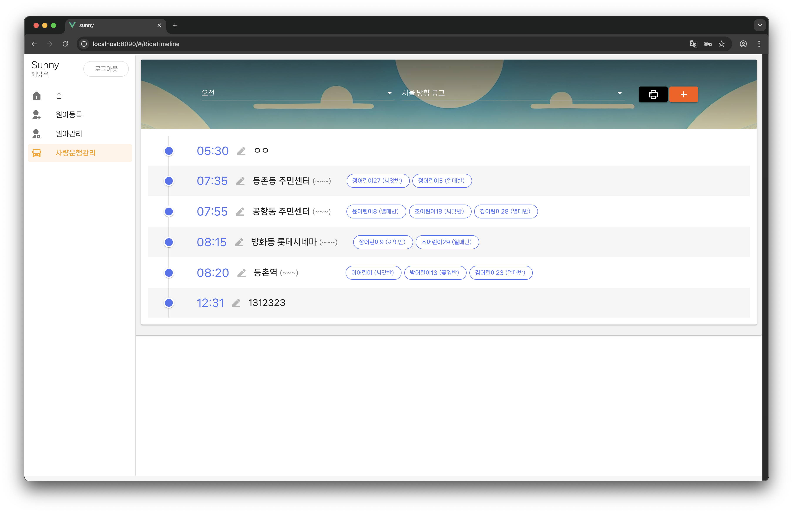
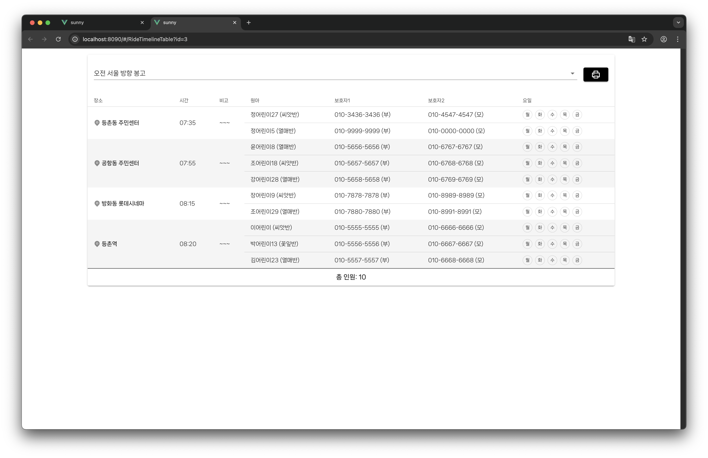
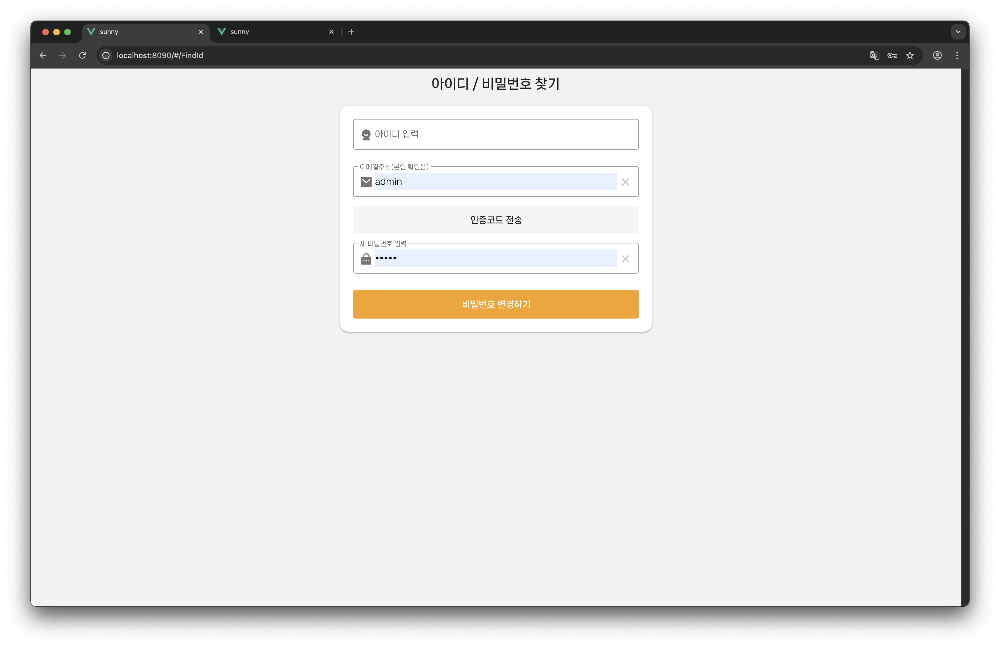

# Sunny 프로젝트

어린이 탑승 및 돌봄 관리를 위한 Vue.js 기반 웹 애플리케이션입니다. 간단한 CRUD 기능과 인증, 타임라인 표시 등을 포함합니다.

## 개요

이 프로젝트는 Vue 2를 사용한 SPA(Single Page Application)입니다. 관리자가:

- 어린이 등록/수정
- 탑승 일정 확인
- 모임 장소 관리
- 로그인/회원가입

등을 할 수 있도록 구성되어 있습니다. 상태 관리는 Vuex, 라우팅은 Vue Router, UI는 Vuetify로 구현되어 있습니다.

## 폴더 구조

```
src/
  api/            # 서버 통신 모듈
  assets/         # 글꼴, 이미지, 스타일
  components/     # 공통 컴포넌트
  plugins/        # 플러그인 (다이얼로그, 로딩, Vuetify 설정)
  router/         # 라우트 설정
  store/          # Vuex 스토어 (actions, getters, mutations)
  utils/          # 유틸리티 함수
  views/          # 페이지 컴포넌트
```

더 자세한 구조는 워크스페이스 트리를 참고하세요.

## 시작하기

### 필요 환경

- Node.js 14 이상
- npm 6 이상

### 설치

```bash
npm install
```

### 개발 서버

```bash
npm run serve
```

브라우저에서 `http://localhost:8080` (콘솔에 표시된 포트)로 접속합니다.

### 배포 빌드

```bash
npm run build
```

### 린트 및 자동 수정

```bash
npm run lint
```

## 설정

`vue.config.js`와 `babel.config.js`에서 설정을 변경할 수 있습니다. 자세한 내용은 [Vue CLI 설정 문서](https://cli.vuejs.org/config/)를 참조하세요.

## 주요 라이브러리

- Vue 2
- Vuex
- Vue Router
- Vuetify
- 기타 유틸리티 (package.json 참조)

### 로그인 화면 (SignIn)



사용자가 이메일과 비밀번호로 로그인하는 기본 화면입니다. 비밀번호 찾기 및 회원가입 링크가 포함되어 있습니다.

### 회원가입 화면 (SignUp)



새 사용자 등록용 폼. 이름, 이메일, 비밀번호 입력과 약관 동의 체크박스를 포함합니다.

### 홈 화면 (SunnyHome)



로그인 후 첫 화면. 최근 탑승 일정과 공지사항, 빠른 이동 버튼들이 표시됩니다.

### 어린이 목록 (ChildList)



등록된 어린이 리스트를 보여주는 화면. 검색 및 필터 기능이 있으며, 각 항목을 클릭하면 상세 정보 화면으로 이동합니다.

### 어린이 상세 정보 (ChildMoreInfo)


선택한 어린이의 상세 정보를 보여줍니다. 수정 및 삭제 버튼이 포함되어 있습니다.

### 어린이 등록/수정 (ChildRegist)



새로운 어린이를 추가하거나 기존 정보를 수정하는 폼 화면입니다.

### 모임 장소 상세 (MeetingLocationMoreInfo)



모임 장소의 위치, 담당자 연락처 등 정보를 보여줍니다.

### 탑승 타임라인 (RideTimeline)



날짜별 탑승 일정을 시간 순으로 표시하는 화면입니다.

### 탑승 타임라인 표 (RideTimelineTable)



탐색 가능한 표 형식으로 탑승 일정을 보여줍니다. 출발지/도착지, 시간, 담당자 정보가 포함됩니다.

### 아이디 찾기 (FindId)



이메일 또는 휴대폰 번호로 아이디(이메일)를 찾는 화면입니다.

---
